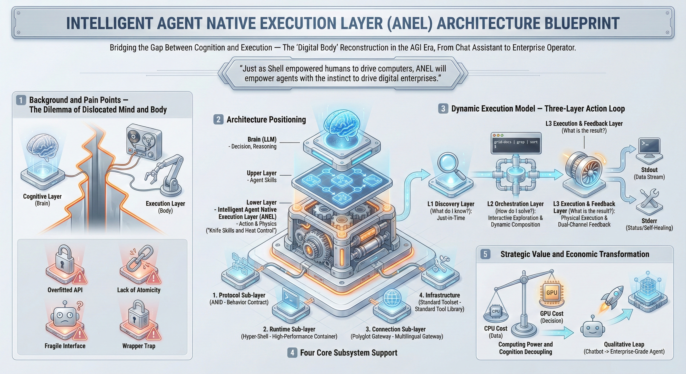

# ANEL — Agent-Native Execution Layer

> LLMs can reason about anything, but struggle to act reliably — because the execution layer was never designed for agents. ANEL changes that: Unix pipes, NDJSON streams, zero-trust sandboxes, and self-healing errors — taking AI agents from conversation to controlled execution.

[中文文档](README_CN.md)

[](#rust-recommended)
[](#typescript)
[](#go)
[](#python)
[](LICENSE)




> **Read more**: [ANEL Architecture Manifesto](docs/ANEL/ANEL-Architecture-Manifesto-v1.0.md)

---

## The Problem — Why ANEL Exists

We have Einstein-level brains (GPT-4, Claude, LLaMA) but communicate with them via Morse code (JSON Schema).

The current state of agent-tool interaction is broken:

```python
# How agents call tools today — fragile and blind
result = subprocess.run(["grep", "-r", "TODO", "."], capture_output=True, text=True)
# stdout: plain text. No schema. No structure.
# failure: returncode == 1. That's all the agent knows.
# discovery: impossible. Agent can't learn what grep accepts.
# safety: full user permissions. No sandbox.
```

This is the **Cognitive-Execution Gap** — the chasm between what LLMs can reason about and what they can actually do:

- **Over-fitted API calls**: Tool Calling (MCP, Function Calling) forces complex logic into JSON structures. Agents spend tokens understanding parameter definitions instead of solving problems.
- **No atomicity or composability**: Tools are isolated black boxes. Agents can't pipe `search | filter | transform` like Unix engineers. They're stuck in think-call-wait-parse loops.
- **Fragile interfaces**: Errors are stack traces for developers, not structured feedback for agents. When something fails, the agent can't self-correct — it spirals.
- **The Wrapper Trap**: Agents are locked into pre-written Python functions. If a developer didn't anticipate a use case, the agent is blind. No exploration, no discovery.

```
TODAY:                              WITH ANEL:

Agent ──subprocess──> Tool          Agent ──ANID Protocol──> Tool
       plain text <──                      NDJSON stream <──
       exit code 1 <──                     RFC 7807 error <──
       (no schema)                         + recovery hints
       (no sandbox)                        + WASI sandbox
       (no trace)                          + trace context
       (no composability)                  + Unix pipe composability
```

**If LLM is the new CPU, our current APIs are tape drives. We need bus-level speed and standards. That's ANEL.**

---

## What is ANEL — Core Philosophy

**ANEL is a standardized execution layer purpose-built for AI agents to interact with tools — analogous to how POSIX standardized how programs interact with operating systems.**

### Unix 2.0 for the Agent Era

ANEL returns to the most fundamental architectural philosophy in computer science: the Unix philosophy. For LLMs pre-trained on massive codebases, shell scripts and pipes are more natural than JSON APIs — they're the model's "native tongue."

- **Agent-as-Operator**: Agents sit at the console like human sysadmins, operating atomic tools directly. No middleware, no wrappers — direct control.
- **Tools as Language**: `qmd search "error" | grep "critical"` isn't just a command — it's the agent's thought process made executable.
- **Affordance**: ANEL lets agents build mental models via `--help`, `--emit-spec`, `--dry-run` — not blind parameter filling.

### The Human Analogy

- **LLM** = Brain (decision, reasoning)
- **Agent Skills** = Professional skills (workflows, SOPs)
- **ANEL** = Hands and feet (precise execution, tactile feedback)

### Four Core Characteristics

1. **Atomicity** — Minimal-granularity operations (`read`, `write`, `compute`), not black-box business functions
2. **Determinism** — Structured input/output eliminates hallucination risk in execution
3. **Streaming Native** — Pipe-based data flow, not request-response waiting
4. **Dual-Mode I/O** — Human visualization (TTY) + agent structured reading (NDJSON)

### Architecture — ANEL's Position in the Stack

```
┌─────────────────────────────────────────────────────┐
│              AI Agent (LLM Brain)                    │
│         Claude · GPT · LLaMA · Gemini               │
└──────────────────────┬──────────────────────────────┘
                       │  Function Calls / MCP / Skills
                       ▼
┌─────────────────────────────────────────────────────┐
│           Agent Skills (Workflow Layer)              │
│      LangChain · AutoGen · CrewAI · Custom          │
└──────────────────────┬──────────────────────────────┘
                       │  Wrap & Drive
                       ▼
┌═════════════════════════════════════════════════════┐
║        ANEL — Agent-Native Execution Layer          ║
║  ┌──────────┐ ┌───────────┐ ┌──────────┐ ┌──────┐ ║
║  │   ANID   │ │Hyper-Shell│ │ Polyglot │ │ Std  │ ║
║  │ Protocol │ │  Runtime  │ │ Gateway  │ │ Tools│ ║
║  └──────────┘ └───────────┘ └──────────┘ └──────┘ ║
╚═════════════════════════════════════════════════════╝
                       │  Structured I/O (NDJSON)
                       ▼
┌─────────────────────────────────────────────────────┐
│                 Infrastructure                       │
│   Databases · K8s · APIs · File Systems · IoT       │
└─────────────────────────────────────────────────────┘
```

---

## ANEL Architecture — Four Subsystems

### 1. ANID Protocol (Agent-Native Interface Definition)

The "legal contract" between agents and tools. Not just I/O definitions — behavioral contracts.

**Core principles:**
- **Stateless**: Each invocation is an independent process or Wasm instance
- **Dual-Stream Separation**: STDOUT = business data (NDJSON), STDERR = control plane (RFC 7807)
- **Zero-Ambiguity**: No human-readable fuzzy text — only structured data

**Mandatory control plane:**

| Flag | Purpose | Behavior |
|------|---------|----------|
| `--emit-spec` | Introspection | Output JSON Schema to STDOUT |
| `--dry-run` | Rehearsal | Validate without side effects, output Impact Report |
| `--output-format` | Format | Accept `json`, `ndjson`, `text`. Default: `ndjson` |

**Environment context (injected by runtime):**

| Variable | Purpose |
|----------|---------|
| `AGENT_TRACE_ID` | Distributed tracing & audit |
| `AGENT_IDENTITY_TOKEN` | Downstream API authentication |

**Structured errors with recovery hints** — the key innovation:

```json
{
  "error_code": "INVALID_INPUT",
  "status": 400,
  "message": "Invalid URL format provided",
  "severity": "error",
  "context": { "input": "google" },
  "recovery_hints": [
    { "code": "FIX_URL", "message": "URL must start with 'http://' or 'https://'" }
  ]
}
```

vs. retryable error:

```json
{
  "error_code": "BACKEND_UNAVAILABLE",
  "status": 503,
  "message": "Connection timed out after 5000ms",
  "severity": "warning",
  "recovery_hints": [
    { "code": "RETRY", "message": "Wait 5 seconds and retry" },
    { "code": "INCREASE_TIMEOUT", "message": "Increase timeout using '--timeout 15'" }
  ]
}
```

**Atomic Capability Contracts** — test fixtures that verify ANID compliance:

```
tests/fixtures/anel/
├── introspection.yaml          # What the tool accepts (static)
├── success.ndjson              # Expected output for known inputs
├── error_invalid_arg.json      # Fatal error: parameter correction
├── error_timeout.json          # Retryable error: retry guidance
└── error_auth_fail.json        # Auth error: credential refresh
```

### 2. Hyper-Shell (Runtime)

If Bash/Zsh is designed for humans, Hyper-Shell is designed for agents. It's the high-performance container that hosts ANEL.

**Four pillars:**

1. **Hyper-Speed**: Rust core + Wasm plugins (wasmtime). Sub-millisecond cold start. Agent's chain-of-thought is never blocked by tool startup latency.

2. **Hyper-Structured**: NDJSON object streams replace text bytes in pipes. Preserves Unix composability, adds SQL-like type safety. Agents parse `{"status": "ok"}` instead of guessing at grep output.

3. **Hyper-Secure**: WASI sandbox with deny-by-default capabilities. Plugins have zero permissions unless explicitly granted (`--allow-read=/tmp/logs`). Even prompt-injected `rm -rf /` is blocked.

4. **Hyper-Observable**: Stream Tap architecture captures all I/O without affecting execution. `AGENT_TRACE_ID` propagation enables full audit trails. Every atomic operation is traceable.

```
Hyper-Shell = Rust Performance + Wasm Security + NDJSON Structure + Unix Composability
```

### 3. Polyglot Gateway (Multi-Language Adapter)

The adapter that connects the legacy world. Enterprises have massive Python scripts, SQL queries, shell commands. The Gateway wraps them into ANID-compliant atomic capabilities without rewriting — making legacy systems instantly "Agent Ready."

- `@anel.expose` decorator in Python/Go/Node.js SDKs
- Auto-generates ANID metadata from existing function signatures
- Bridges old tools into the structured ANEL ecosystem

### 4. Standard Toolset

Enterprise-grade atomic capability library. Tools designed like `curl` or `kubectl` — general-purpose, self-documenting, composable.

Each tool ships with full ANID contracts (introspection, success fixtures, error fixtures).

---

## Dynamic Runtime Model — Three Layers

### L1 — Discovery Layer: "What do I know?"

- Agent searches tools via `search-tools` or `apropos`
- Dynamically loads tool usage via `--emit-spec` or `--help`
- Just-in-time knowledge acquisition, breaking context window limits

### L2 — Orchestration Layer: "How do I solve this?"

- **Interactive exploration**: Execute probe commands, adjust strategy based on feedback
- **Dynamic composition**: Pipe atomic capabilities into workflows the developer never anticipated

### L3 — Execution & Feedback Layer: "What happened?"

- High-performance Rust kernel executes commands
- **STDOUT**: Business data stream
- **STDERR**: Structured machine-readable status (ANID protocol), forming closed-loop control

---

## ANEL vs Agent Skills — The Relationship

**Conceptual boundary:**
- Agent Skills = "recipes" (workflow logic, when to use, parameter preparation)
- ANEL = "knife skills and heat control" (precise execution, physical feedback)

Skills are the brain's "battle plan." ANEL is the mechanized force executing it on the ground. When facing unknown problems, agents can either invoke Skills (fixed workflows) or bypass them entirely to operate ANEL atomic tools directly for creative problem-solving.

**Code-level integration:**

```python
class ServiceHealthCheckSkill(BaseTool):
    name = "service_health_check"
    description = "Check service health status. Input: service URL."

    def _run(self, target_url: str) -> dict:
        cmd = ["qmd", "query", target_url,
               "--output-format", "ndjson"]
        result = subprocess.run(cmd, capture_output=True, text=True)
        if result.returncode != 0:
            error = json.loads(result.stderr)
            return f"Failed: {error['message']}. Hint: {error['recovery_hints']}"
        return [json.loads(line) for line in result.stdout.splitlines()]
```

**Deployment modes:**
- **CLI mode**: Development, < 50 agents
- **Server/Sidecar mode**: Production, > 1000 agents (Rust async + Wasm = 1 process handles thousands of requests)

---

## This Project — Reference Implementation

To prove ANEL works, we needed a real-world application as the reference implementation. We chose [qmd](https://github.com/tobi/qmd) by [Tobi Lütke](https://github.com/tobi) as the starting point — a beautifully minimal local search engine for docs, knowledge bases, and meeting notes that tracks current SOTA approaches while staying fully local. Its clean architecture and pragmatic design made it the ideal foundation for demonstrating ANEL concepts.

Building on qmd, we extended it into a full **AI-native document search engine** with hybrid BM25 + vector search + LLM reranking, and re-implemented it in four languages (Rust, TypeScript, Go, Python) sharing the same ANID protocol. This is why all implementation directories are named `qmd-*`.

Why search? It's the most common agent tool, and it exercises all ANEL features: streaming output, structured error recovery, introspection, trace context, and composability.

---

## Four Implementations

| Feature | Rust | TypeScript | Go | Python |
|---|---|---|---|---|
| ANID Protocol | Full | Full | Full | Full |
| `--emit-spec` / `--dry-run` | All commands | All commands | All commands | All commands |
| NDJSON Streaming | ✓ | ✓ | ✓ | ✓ |
| RFC 7807 Errors + Recovery Hints | ✓ | ✓ | ✓ | ✓ |
| Trace Context (`AGENT_TRACE_ID`) | ✓ | ✓ | ✓ | ✓ |
| BM25 Search | SQLite FTS5 | SQLite FTS5 | SQLite FTS5 | SQLite FTS5 |
| Vector Search | sqlite-vec + LanceDB + Qdrant | sqlite-vec | sqlite-vec + Qdrant | sqlite-vec + LanceDB + Qdrant |
| Local LLM | llama.cpp (GGUF) | node-llama-cpp | — | llama-cpp-python |
| Remote LLM | OpenAI-compatible | — | — | OpenAI-compatible |
| MCP Server | stdio + SSE | stdio | stdio | stdio |
| HTTP Server | Axum (REST + Prometheus) | — | — | — |
| Wasm Plugin System | wasmtime | — | — | — |
| Observability | Prometheus + tracing | — | — | — |
| Output Formats | 7 (cli/json/ndjson/md/csv/xml/files) | 6 (cli/json/ndjson/md/csv/xml) | 6 | 6 |
| Runtime | Native binary | Bun | Compiled binary | Python 3.10+ |
| Best for | Production / Reference | Web prototyping | Embedded / CLI | ML / Data pipelines |

### Rust (Recommended)

The reference implementation. Full ANEL support including Wasm plugin system, HTTP server with Prometheus metrics, and OpenTelemetry tracing. Built with `clap`, `rusqlite`, `rmcp`, `axum`, and `wasmtime`.

### TypeScript

Lightweight implementation running on Bun. Uses `node-llama-cpp` for local embeddings and reranking, `@modelcontextprotocol/sdk` for MCP, and `sqlite-vec` for vector search. Ideal for rapid prototyping.

### Go

Compiled binary with minimal dependencies. Uses `cobra` for CLI, `go-sqlite3` for storage, and `go-client` for Qdrant. Clean, fast, and easy to deploy.

### Python

ML-friendly implementation with `typer`, `lancedb`, `qdrant-client`, and optional `llama-cpp-python`. Integrates with OpenAI and Anthropic APIs. Best for data science workflows.

---

## Quick Start

<details>
<summary><b>Rust (Recommended)</b></summary>

```bash
# Build
cd src/qmd-rust
cargo build --release

# Add a document collection
./target/release/qmd-rust collection add ~/Documents/notes --name mynotes --mask '**/*.md'

# Index and embed
./target/release/qmd-rust update
./target/release/qmd-rust embed

# Search
./target/release/qmd-rust search "error handling"
./target/release/qmd-rust vsearch "how to handle errors"
./target/release/qmd-rust query "best practices for error handling"

# ANEL in action
./target/release/qmd-rust search --emit-spec          # Introspection
./target/release/qmd-rust search "test" --dry-run      # Rehearsal
./target/release/qmd-rust search "test" --format ndjson # Structured output
```

</details>

<details>
<summary><b>TypeScript</b></summary>

```bash
# Install
cd src/qmd-typescript
bun install
bun link  # Installs globally as 'qmd'

# Add a document collection
qmd collection add ~/Documents/notes --name mynotes --mask '**/*.md'

# Index and embed
qmd update
qmd embed

# Search
qmd search "error handling"
qmd vsearch "how to handle errors"
qmd query "best practices for error handling"

# ANEL in action
qmd search --emit-spec
qmd search "test" --dry-run
qmd search "test" --json   # or --csv, --md, --xml
```

</details>

<details>
<summary><b>Go</b></summary>

```bash
# Build
cd src/qmd-go
go build -o qmd ./cmd/qmd

# Add a document collection
./qmd collection add ~/Documents/notes --name mynotes --mask '**/*.md'

# Index and embed
./qmd update
./qmd embed

# Search
./qmd search "error handling"
./qmd vsearch "how to handle errors"
./qmd query "best practices for error handling"

# ANEL in action
./qmd search --emit-spec
./qmd search "test" --dry-run
./qmd search "test" --format ndjson
```

</details>

<details>
<summary><b>Python</b></summary>

```bash
# Install
cd src/qmd-python
pip install -e .
# With local LLM support:
pip install -e ".[local]"

# Add a document collection
python -m qmd_python collection add ~/Documents/notes --name mynotes --mask '**/*.md'

# Index and embed
python -m qmd_python update
python -m qmd_python embed

# Search
python -m qmd_python search "error handling"
python -m qmd_python vsearch "how to handle errors"
python -m qmd_python query "best practices for error handling"

# ANEL in action
python -m qmd_python search --emit-spec
python -m qmd_python search "test" --dry-run
python -m qmd_python search "test" --format ndjson
```

</details>

---

## Search Pipeline Architecture

```
                      ┌──────────────┐
                      │  Agent Query │
                      └──────┬───────┘
                             │
                 ┌───────────┴───────────┐
                 ▼                       ▼
         ┌──────────────┐       ┌──────────────┐
         │  BM25 Search │       │ Vector Search│
         │ (SQLite FTS5)│       │ (sqlite-vec) │
         └──────┬───────┘       └──────┬───────┘
                │                      │
                └──────────┬───────────┘
                           ▼
                ┌─────────────────────┐
                │  RRF Fusion (k=60)  │
                └──────────┬──────────┘
                           ▼
                ┌─────────────────────┐
                │   LLM Re-ranking    │
                │  (local GGUF model) │
                └──────────┬──────────┘
                           ▼
                ┌─────────────────────┐
                │  NDJSON Stream Out  │
                │  (ANID Protocol)    │
                └─────────────────────┘
```

**Agent workflow example:**

```bash
# 1. Discovery — what can this tool do?
$ qmd search --emit-spec
{"version":"1.0","command":"search","input_schema":{...},"output_schema":{...}}

# 2. Rehearsal — what would happen?
$ qmd search "database migration" --dry-run
{"dry_run":true,"would_search":"database migration","collections":["notes"],...}

# 3. Execute — get results as structured stream
$ qmd query "database migration" --format ndjson
{"type":"result","seq":1,"payload":{"docid":"#a3f2c1","path":"docs/migration.md","score":0.92}}
{"type":"result","seq":2,"payload":{"docid":"#b7e4d9","path":"guides/db-setup.md","score":0.87}}

# 4. Error recovery — agent self-heals
$ qmd search "test" --collection nonexistent
# STDERR:
{"error_code":"COLLECTION_NOT_FOUND","status":404,"message":"Collection 'nonexistent' not found",
 "recovery_hints":[{"code":"LIST_COLLECTIONS","message":"Run 'qmd collection list' to see available collections"}]}
```

---

## MCP Integration

All implementations expose an MCP server for seamless integration with Claude Desktop, Claude Code, and other MCP clients.

**Claude Desktop / Claude Code configuration:**

```json
{
  "mcpServers": {
    "qmd": {
      "command": "qmd",
      "args": ["mcp"]
    }
  }
}
```

**Exposed MCP tools:**

| Tool | Description |
|------|-------------|
| `search` | BM25 full-text search |
| `vsearch` | Vector semantic search |
| `query` | Hybrid search with RRF fusion and reranking |
| `get` | Retrieve document by path or docid |
| `multi_get` | Retrieve multiple documents by glob pattern |
| `collection` | Manage document collections |
| `status` | Show index status |

---

## Roadmap

| Phase | Status | Description |
|-------|--------|-------------|
| Phase 0 | ✅ Done | ANID Protocol specification (RFC) |
| Phase 1-3 | ✅ Done | Kernel skeleton, Dual-Mode I/O, Wasm engine, Plugin system |
| Phase 4-8 | ✅ Done | Security (WASI sandbox), Observability, Search pipeline, Agent routing |
| Phase 9-12 | ✅ Done | LLM reranking, Multi-language implementations (4 languages, 100% parity) |
| Phase 13 | 🔄 Current | Standard tool library (std-fs, std-net, std-k8s) |
| Phase 14 | 📋 Planned | Framework SDKs (LangChain, AutoGen, CrewAI adapters) |
| Phase 15 | 🔮 Future | Cloud-native (K8s Operator, Sidecar mode, remote execution) |

---

## Configuration

Default config location: `~/.config/qmd/index.yaml`

```yaml
bm25:
  backend: "sqlite_fts5"

vector:
  backend: "qmd_builtin"
  model: "embeddinggemma-300M"

collections:
  - name: "notes"
    path: "~/notes"
    pattern: "**/*.md"

models:
  embed:
    local: "embeddinggemma-300M"
  query:
    local: "qwen3"
  rerank:
    local: "qwen3-reranker"
```

---

## Project Structure

```
qmd/
├── docs/
│   └── ANEL/                    # ANEL architecture documents
│       ├── ⭐️ 架构宣言 v1.0     # Architecture manifesto
│       ├── ⭐️ ANID v1.0 RFC     # Protocol specification
│       ├── ⭐️ Hyper-Shell        # Runtime architecture
│       └── ...                   # Contracts, roadmap, skills relationship
├── src/
│   ├── qmd-rust/                # Rust — reference implementation
│   │   └── src/
│   │       ├── anel/            # ANEL protocol (errors, specs, trace)
│   │       ├── cli/             # CLI commands + agent routing
│   │       ├── store/           # Search engine (BM25 + vector + RRF)
│   │       ├── llm/             # LLM router (embed, rerank, expand)
│   │       ├── mcp/             # MCP server (stdio + SSE)
│   │       ├── server/          # HTTP server (Axum + Prometheus)
│   │       ├── plugin/          # Wasm plugin system (wasmtime)
│   │       ├── formatter/       # Output formats (7 formats)
│   │       └── config/          # Configuration management
│   ├── qmd-typescript/          # TypeScript — Bun runtime
│   ├── qmd-go/                  # Go — compiled binary
│   └── qmd-python/              # Python — ML-friendly
└── README.md
```

---

## Acknowledgments

- [qmd](https://github.com/tobi/qmd) by [Tobi Lütke](https://github.com/tobi) — the starting point project for this ANEL reference implementation. Thank you for the inspiration and the excellent work.

## License

MIT
