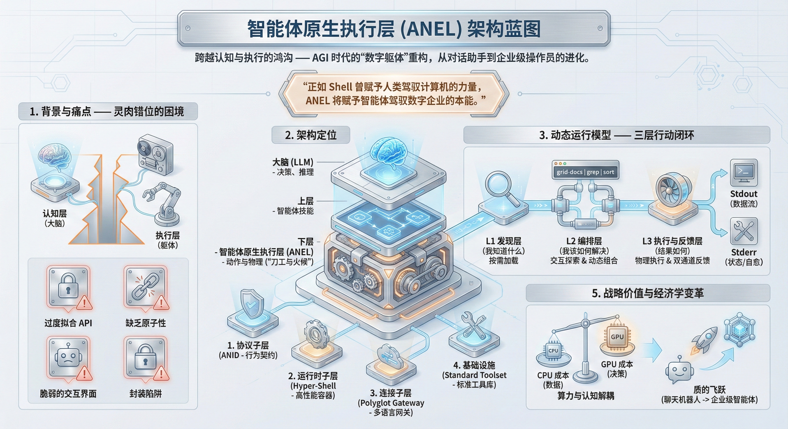

# ANEL — 智能体原生执行层

> 大模型什么都能想到，却难以可靠地执行 —— 因为执行层从未为智能体设计过。ANEL 用 Unix 管道、NDJSON 流、零信任沙箱和自愈错误协议，为 AI 智能体构建了一套真正能上手操作的执行层 —— 从"聊天对话"走向"可控执行"。

[English](README.md)

[](#rust-推荐)
[](#typescript)
[](#go)
[](#python)
[](LICENSE)




> **阅读更多**：[智能体原生执行层 (ANEL) 架构宣言](docs/ANEL/⭐%20智能体原生执行层%20(ANEL)%20架构宣言%20v1%200——%20AGI%20时代的"数字躯体"重构.md)

---

## 痛点 — 为什么需要 ANEL

我们拥有了爱因斯坦般的大脑（GPT-4、Claude、LLaMA），却只能通过摩尔斯电码（JSON Schema）来指挥它干活。

当前智能体与工具的交互方式已经破碎：

```python
# 今天智能体调用工具的方式 —— 脆弱且盲目
result = subprocess.run(["grep", "-r", "TODO", "."], capture_output=True, text=True)
# stdout: 纯文本。没有 Schema。没有结构。
# 失败: returncode == 1。智能体只知道这些。
# 发现: 不可能。智能体无法学习 grep 接受什么参数。
# 安全: 完整用户权限。没有沙箱。
```

这就是**"认知-执行鸿沟 (Cognitive-Execution Gap)"** —— LLM 能推理的和它实际能做的之间的深渊：

- **过度拟合的 API 调用**：Tool Calling（MCP、Function Calling）本质上是把复杂的业务逻辑硬塞进 JSON 结构里。Agent 被迫花费大量 Token 去理解参数定义，而不是专注于解决问题。
- **缺乏原子性与组合性**：工具是孤立的黑盒。Agent 无法像 Unix 工程师那样 `search | filter | transform` 流畅串联。它被困在"思考-调用-等待-解析"的循环里。
- **脆弱的交互界面**：错误信息是给开发者看的堆栈信息，不是给智能体的结构化反馈。出错时，Agent 无法自我修正，只能陷入死循环。
- **封装陷阱 (The Wrapper Trap)**：Agent 被锁死在预先编写的 Python 函数里。如果程序员没有预设某个用例，Agent 就是瞎子。没有探索，没有发现。

```
现状:                               使用 ANEL:

Agent ──subprocess──> Tool          Agent ──ANID 协议──> Tool
       纯文本 <──                          NDJSON 流 <──
       exit code 1 <──                     RFC 7807 错误 <──
       (无 Schema)                         + 自愈建议
       (无沙箱)                            + WASI 沙箱
       (无追踪)                            + 链路追踪
       (无组合性)                          + Unix 管道组合
```

**如果 LLM 是全新的 CPU，那我们现有的 API 就是旧时代的磁带机。我们需要总线级的速度和标准。这就是 ANEL。**

---

## 什么是 ANEL — 核心哲学

**ANEL 是专为 AI 智能体与工具交互而设计的标准化执行层 —— 类似于 POSIX 标准化了程序与操作系统的交互方式。**

### Unix 2.0：智能体时代的操作哲学

ANEL 回归计算机科学最本质的架构哲学：Unix 哲学。对于预训练过海量代码的 LLM 而言，Shell 脚本与管道是比 JSON API 更自然的"母语"。

- **智能体即操作员 (Agent-as-Operator)**：Agent 直接坐在控制台前，像人类系统管理员一样操作企业级原子工具。去中介化，直接控制。
- **工具即语言 (Tools as Language)**：`qmd search "异常" | grep "critical"` 不仅是命令，更是智能体思考过程的直接体现。
- **可供性 (Affordance)**：ANEL 让 Agent 通过 `--help`、`--emit-spec`、`--dry-run` 建立心智模型，而非盲目填参。

### 人体隐喻

- **LLM** = 大脑（决策、推理）
- **Agent Skills** = 职业技能（工作流、SOP）
- **ANEL** = 手和脚（精准执行、触觉反馈）

### 四大核心特征

1. **原子化 (Atomicity)** — 最小粒度操作（`读取`、`写入`、`计算`），而非黑盒式业务函数
2. **确定性 (Determinism)** — 结构化输入/输出消除执行中的幻觉风险
3. **流式原生 (Streaming Native)** — 管道式数据流，而非请求-响应等待
4. **双模态 I/O (Dual-Mode)** — 人类可视化监控（TTY）+ 智能体结构化读取（NDJSON）

### 架构全景 — ANEL 在技术栈中的位置

```
┌─────────────────────────────────────────────────────┐
│              AI 智能体 (LLM 大脑)                     │
│         Claude · GPT · LLaMA · Gemini               │
└──────────────────────┬──────────────────────────────┘
                       │  Function Calls / MCP / Skills
                       ▼
┌─────────────────────────────────────────────────────┐
│           Agent Skills (业务编排层)                    │
│      LangChain · AutoGen · CrewAI · Custom          │
└──────────────────────┬──────────────────────────────┘
                       │  封装 & 驱动
                       ▼
┌═════════════════════════════════════════════════════┐
║        ANEL — 智能体原生执行层                        ║
║  ┌──────────┐ ┌───────────┐ ┌──────────┐ ┌──────┐ ║
║  │   ANID   │ │Hyper-Shell│ │ Polyglot │ │ 标准 │ ║
║  │   协议   │ │   运行时   │ │   网关   │ │ 工具 │ ║
║  └──────────┘ └───────────┘ └──────────┘ └──────┘ ║
╚═════════════════════════════════════════════════════╝
                       │  结构化 I/O (NDJSON)
                       ▼
┌─────────────────────────────────────────────────────┐
│                   基础设施                            │
│   数据库 · K8s · API · 文件系统 · IoT                 │
└─────────────────────────────────────────────────────┘
```

---

## ANEL 架构 — 四大子系统

### 1. ANID 协议 (Agent-Native Interface Definition)

智能体与工具之间的"法律条款"。不仅定义输入/输出，更定义行为契约。

**核心原则：**
- **无状态 (Stateless)**：每次调用都是独立的进程或 Wasm 实例
- **双流分离 (Dual-Stream)**：STDOUT = 业务数据（NDJSON），STDERR = 控制面（RFC 7807）
- **零歧义 (Zero-Ambiguity)**：禁止输出人类可读的模糊文本，必须输出结构化数据

**必需控制面参数：**

| 参数 | 用途 | 行为 |
|------|------|------|
| `--emit-spec` | 自省 | 向 STDOUT 输出 JSON Schema |
| `--dry-run` | 预演 | 执行检查但不产生副作用，输出影响报告 |
| `--output-format` | 格式 | 接受 `json`、`ndjson`、`text`，默认 `ndjson` |

**环境变量（运行时注入）：**

| 变量名 | 用途 |
|--------|------|
| `AGENT_TRACE_ID` | 分布式追踪与审计 |
| `AGENT_IDENTITY_TOKEN` | 下游 API 鉴权 |

**结构化错误 + 自愈建议** —— 关键创新：

```json
{
  "error_code": "INVALID_INPUT",
  "status": 400,
  "message": "Invalid URL format provided",
  "severity": "error",
  "context": { "input": "google" },
  "recovery_hints": [
    { "code": "FIX_URL", "message": "URL 必须以 'http://' 或 'https://' 开头" }
  ]
}
```

可重试错误：

```json
{
  "error_code": "BACKEND_UNAVAILABLE",
  "status": 503,
  "message": "连接超时 (5000ms)",
  "severity": "warning",
  "recovery_hints": [
    { "code": "RETRY", "message": "等待 5 秒后重试" },
    { "code": "INCREASE_TIMEOUT", "message": "使用 '--timeout 15' 增加超时时间" }
  ]
}
```

**原子能力契约** —— 验证 ANID 合规性的测试固件：

```
tests/fixtures/anel/
├── introspection.yaml          # 工具接受什么（静态定义）
├── success.ndjson              # 已知输入的预期输出
├── error_invalid_arg.json      # 致命错误：参数修正
├── error_timeout.json          # 可重试错误：重试指导
└── error_auth_fail.json        # 鉴权错误：凭证刷新
```

### 2. Hyper-Shell（运行时）

如果 Bash/Zsh 是为人类设计的交互环境，Hyper-Shell 就是专为智能体设计的原生运行时 —— 智能体的"数字外骨骼"。

**四重核心内涵：**

1. **极速启动 (Hyper-Speed)**：Rust 内核 + Wasm 插件（wasmtime）。亚毫秒级冷启动。Agent 的思维链永远不会被工具启动延迟阻断。

2. **结构化流 (Hyper-Structured)**：NDJSON 对象流取代管道中的文本字节。保留 Unix 组合性，引入类 SQL 的类型确定性。Agent 直接解析 `{"status": "ok"}` 而非猜测 grep 输出。

3. **零信任沙箱 (Hyper-Secure)**：WASI 沙箱，默认拒绝一切权限。插件没有任何权限，除非显式授权（`--allow-read=/tmp/logs`）。即使被注入 `rm -rf /` 也会被拦截。

4. **全息可观测 (Hyper-Observable)**：流式审计（Stream Tap）架构在不影响执行的前提下捕获所有 I/O。`AGENT_TRACE_ID` 传播实现全链路审计。每一次原子操作都可追溯。

```
Hyper-Shell = Rust 性能 + Wasm 安全 + NDJSON 结构化 + Unix 组合性
```

### 3. Polyglot Gateway（多语言统一网关）

连接企业旧世界的"适配器"。企业有大量的 Python 脚本、SQL 查询、Shell 命令。Gateway 将它们封装成符合 ANID 标准的原子能力，无需重写 —— 让老旧系统瞬间具备"Agent Ready"的能力。

- Python/Go/Node.js SDK 中的 `@anel.expose` 装饰器
- 从现有函数签名自动生成 ANID 元数据
- 将旧工具桥接到结构化的 ANEL 生态

### 4. 标准工具库

企业级原子能力库。工具设计如 `curl` 或 `kubectl` —— 通用、自文档化、可组合。

每个工具都附带完整的 ANID 契约（自省定义、成功固件、错误固件）。

---

## 动态运行模型 — 三层架构

### L1 — 发现层："我知道什么？"

- Agent 通过 `search-tools` 或 `apropos` 模糊搜索工具
- 通过 `--emit-spec` 或 `--help` 动态获取工具用法
- 按需加载（Just-in-Time）的知识获取，打破上下文窗口限制

### L2 — 编排层："我该如何解决？"

- **交互式探索**：执行探测命令，根据反馈实时调整策略
- **动态组合**：利用管道即时组合原子能力，创造开发者未曾预设的工作流

### L3 — 执行与反馈层："结果如何？"

- 高性能 Rust 内核执行命令
- **STDOUT**：业务数据流
- **STDERR**：结构化的机器可读状态（ANID 协议），形成闭环控制

---

## ANEL 与 Agent Skills 的关系

**概念分界线：**
- Agent Skills = "菜谱"（工作流逻辑、何时使用、参数准备）
- ANEL = "刀工和火候"（精准执行、物理反馈）

Skills 是大脑中的"作战计划"，ANEL 是战场上执行计划的"机械化部队"。面对未知问题时，Agent 既可以调用 Skills（固定流程），也可以跳过 Skills 直接操作 ANEL 原子工具进行创造性解决。

**代码级集成：**

```python
class ServiceHealthCheckSkill(BaseTool):
    name = "service_health_check"
    description = "查询服务健康状态。输入参数为服务 URL。"

    def _run(self, target_url: str) -> dict:
        # Skill (Python) 驱动 ANEL (Rust CLI)
        cmd = ["qmd", "query", target_url,
               "--output-format", "ndjson"]
        result = subprocess.run(cmd, capture_output=True, text=True)
        if result.returncode != 0:
            error = json.loads(result.stderr)
            return f"执行失败: {error['message']}. 建议: {error['recovery_hints']}"
        return [json.loads(line) for line in result.stdout.splitlines()]
```

**部署模式：**
- **CLI 模式**：开发调试，< 50 个 Agent
- **Server/Sidecar 模式**：生产环境，> 1000 个 Agent（Rust 异步 + Wasm = 1 个进程处理数千请求）

---

## 本项目 — 参考实现

为了验证 ANEL 的可行性，我们需要一个真实的应用作为参考实现。我们选择了 [Tobi Lütke](https://github.com/tobi) 的 [qmd](https://github.com/tobi/qmd) 作为起点项目 —— 一个精巧的本地文档搜索引擎，支持知识库、会议记录等场景，追踪当前 SOTA 方案且完全本地运行。它简洁的架构和务实的设计，使其成为展示 ANEL 概念的理想基础。

在 qmd 的基础上，我们将其扩展为完整的 **AI 原生文档搜索引擎**，支持混合 BM25 + 向量搜索 + LLM 重排序，并使用四种语言（Rust、TypeScript、Go、Python）重新实现，共享同一套 ANID 协议。这也是所有实现目录都命名为 `qmd-*` 的原因。

为什么选择搜索？因为它是最常见的智能体工具，且能充分验证 ANEL 的所有特性：流式输出、结构化错误恢复、自省、链路追踪、组合性。

---

## 四种实现 — 对比

| 特性 | Rust | TypeScript | Go | Python |
|---|---|---|---|---|
| ANID 协议 | 完整 | 完整 | 完整 | 完整 |
| `--emit-spec` / `--dry-run` | 所有命令 | 所有命令 | 所有命令 | 所有命令 |
| NDJSON 流式输出 | ✓ | ✓ | ✓ | ✓ |
| RFC 7807 错误 + 自愈建议 | ✓ | ✓ | ✓ | ✓ |
| 链路追踪 (`AGENT_TRACE_ID`) | ✓ | ✓ | ✓ | ✓ |
| BM25 搜索 | SQLite FTS5 | SQLite FTS5 | SQLite FTS5 | SQLite FTS5 |
| 向量搜索 | sqlite-vec + LanceDB + Qdrant | sqlite-vec | sqlite-vec + Qdrant | sqlite-vec + LanceDB + Qdrant |
| 本地 LLM | llama.cpp (GGUF) | node-llama-cpp | — | llama-cpp-python |
| 远程 LLM | OpenAI 兼容 | — | — | OpenAI 兼容 |
| MCP 服务器 | stdio + SSE | stdio | stdio | stdio |
| HTTP 服务器 | Axum (REST + Prometheus) | — | — | — |
| Wasm 插件系统 | wasmtime | — | — | — |
| 可观测性 | Prometheus + tracing | — | — | — |
| 输出格式 | 7 种 (cli/json/ndjson/md/csv/xml/files) | 6 种 | 6 种 | 6 种 |
| 运行时 | 原生二进制 | Bun | 编译二进制 | Python 3.10+ |
| 最适合 | 生产环境 / 参考实现 | Web 原型开发 | 嵌入式 / CLI | ML / 数据管道 |

### Rust（推荐）

参考实现。完整 ANEL 支持，包括 Wasm 插件系统、带 Prometheus 指标的 HTTP 服务器、OpenTelemetry 追踪。基于 `clap`、`rusqlite`、`rmcp`、`axum`、`wasmtime` 构建。

### TypeScript

基于 Bun 运行时的轻量实现。使用 `node-llama-cpp` 进行本地嵌入和重排序，`@modelcontextprotocol/sdk` 提供 MCP 支持，`sqlite-vec` 进行向量搜索。适合快速原型开发。

### Go

最小依赖的编译二进制。使用 `cobra` 构建 CLI，`go-sqlite3` 存储，`go-client` 连接 Qdrant。简洁、快速、易部署。

### Python

ML 友好的实现。使用 `typer`、`lancedb`、`qdrant-client`，可选 `llama-cpp-python`。集成 OpenAI 和 Anthropic API。最适合数据科学工作流。

---

## 快速开始

<details>
<summary><b>Rust（推荐）</b></summary>

```bash
# 构建
cd src/qmd-rust
cargo build --release

# 添加文档集合
./target/release/qmd-rust collection add ~/Documents/notes --name mynotes --mask '**/*.md'

# 索引和嵌入
./target/release/qmd-rust update
./target/release/qmd-rust embed

# 搜索
./target/release/qmd-rust search "错误处理"
./target/release/qmd-rust vsearch "如何处理错误"
./target/release/qmd-rust query "错误处理最佳实践"

# ANEL 实战
./target/release/qmd-rust search --emit-spec          # 自省
./target/release/qmd-rust search "test" --dry-run      # 预演
./target/release/qmd-rust search "test" --format ndjson # 结构化输出
```

</details>

<details>
<summary><b>TypeScript</b></summary>

```bash
# 安装
cd src/qmd-typescript
bun install
bun link  # 全局安装为 'qmd' 命令

# 添加文档集合
qmd collection add ~/Documents/notes --name mynotes --mask '**/*.md'

# 索引和嵌入
qmd update
qmd embed

# 搜索
qmd search "错误处理"
qmd vsearch "如何处理错误"
qmd query "错误处理最佳实践"

# ANEL 实战
qmd search --emit-spec
qmd search "test" --dry-run
qmd search "test" --json   # 或 --csv, --md, --xml
```

</details>

<details>
<summary><b>Go</b></summary>

```bash
# 构建
cd src/qmd-go
go build -o qmd ./cmd/qmd

# 添加文档集合
./qmd collection add ~/Documents/notes --name mynotes --mask '**/*.md'

# 索引和嵌入
./qmd update
./qmd embed

# 搜索
./qmd search "错误处理"
./qmd vsearch "如何处理错误"
./qmd query "错误处理最佳实践"

# ANEL 实战
./qmd search --emit-spec
./qmd search "test" --dry-run
./qmd search "test" --format ndjson
```

</details>

<details>
<summary><b>Python</b></summary>

```bash
# 安装
cd src/qmd-python
pip install -e .
# 带本地 LLM 支持：
pip install -e ".[local]"

# 添加文档集合
python -m qmd_python collection add ~/Documents/notes --name mynotes --mask '**/*.md'

# 索引和嵌入
python -m qmd_python update
python -m qmd_python embed

# 搜索
python -m qmd_python search "错误处理"
python -m qmd_python vsearch "如何处理错误"
python -m qmd_python query "错误处理最佳实践"

# ANEL 实战
python -m qmd_python search --emit-spec
python -m qmd_python search "test" --dry-run
python -m qmd_python search "test" --format ndjson
```

</details>

---

## 搜索管道架构

```
                      ┌──────────────┐
                      │  智能体查询   │
                      └──────┬───────┘
                             │
                 ┌───────────┴───────────┐
                 ▼                       ▼
         ┌──────────────┐       ┌──────────────┐
         │  BM25 搜索   │       │  向量搜索     │
         │ (SQLite FTS5)│       │ (sqlite-vec) │
         └──────┬───────┘       └──────┬───────┘
                │                      │
                └──────────┬───────────┘
                           ▼
                ┌─────────────────────┐
                │  RRF 融合 (k=60)    │
                └──────────┬──────────┘
                           ▼
                ┌─────────────────────┐
                │   LLM 重排序        │
                │  (本地 GGUF 模型)    │
                └──────────┬──────────┘
                           ▼
                ┌─────────────────────┐
                │  NDJSON 流式输出     │
                │  (ANID 协议)        │
                └─────────────────────┘
```

**智能体工作流示例：**

```bash
# 1. 发现 — 这个工具能做什么？
$ qmd search --emit-spec
{"version":"1.0","command":"search","input_schema":{...},"output_schema":{...}}

# 2. 预演 — 会发生什么？
$ qmd search "数据库迁移" --dry-run
{"dry_run":true,"would_search":"数据库迁移","collections":["notes"],...}

# 3. 执行 — 获取结构化流式结果
$ qmd query "数据库迁移" --format ndjson
{"type":"result","seq":1,"payload":{"docid":"#a3f2c1","path":"docs/migration.md","score":0.92}}
{"type":"result","seq":2,"payload":{"docid":"#b7e4d9","path":"guides/db-setup.md","score":0.87}}

# 4. 错误恢复 — 智能体自愈
$ qmd search "test" --collection nonexistent
# STDERR:
{"error_code":"COLLECTION_NOT_FOUND","status":404,"message":"集合 'nonexistent' 不存在",
 "recovery_hints":[{"code":"LIST_COLLECTIONS","message":"运行 'qmd collection list' 查看可用集合"}]}
```

---

## MCP 集成

所有实现都暴露 MCP 服务器，可无缝集成 Claude Desktop、Claude Code 及其他 MCP 客户端。

**Claude Desktop / Claude Code 配置：**

```json
{
  "mcpServers": {
    "qmd": {
      "command": "qmd",
      "args": ["mcp"]
    }
  }
}
```

**暴露的 MCP 工具：**

| 工具 | 描述 |
|------|------|
| `search` | BM25 全文搜索 |
| `vsearch` | 向量语义搜索 |
| `query` | 混合搜索（RRF 融合 + 重排序） |
| `get` | 按路径或 docid 获取文档 |
| `multi_get` | 按 glob 模式获取多个文档 |
| `collection` | 管理文档集合 |
| `status` | 显示索引状态 |

---

## 路线图

| 阶段 | 状态 | 描述 |
|------|------|------|
| Phase 0 | ✅ 完成 | ANID 协议规范 (RFC) |
| Phase 1-3 | ✅ 完成 | 内核骨架、双模态 I/O、Wasm 引擎、插件系统 |
| Phase 4-8 | ✅ 完成 | 安全（WASI 沙箱）、可观测性、搜索管道、智能路由 |
| Phase 9-12 | ✅ 完成 | LLM 重排序、多语言实现（4 种语言，100% 功能对齐） |
| Phase 13 | 🔄 进行中 | 标准工具库 (std-fs, std-net, std-k8s) |
| Phase 14 | 📋 计划中 | 框架 SDK（LangChain、AutoGen、CrewAI 适配器） |
| Phase 15 | 🔮 远期 | 云原生（K8s Operator、Sidecar 模式、远程执行） |

---

## 配置

默认配置路径：`~/.config/qmd/index.yaml`

```yaml
bm25:
  backend: "sqlite_fts5"

vector:
  backend: "qmd_builtin"
  model: "embeddinggemma-300M"

collections:
  - name: "notes"
    path: "~/notes"
    pattern: "**/*.md"

models:
  embed:
    local: "embeddinggemma-300M"
  query:
    local: "qwen3"
  rerank:
    local: "qwen3-reranker"
```

---

## 项目结构

```
qmd/
├── docs/
│   └── ANEL/                    # ANEL 架构文档
│       ├── ⭐️ 架构宣言 v1.0     # 核心宣言
│       ├── ⭐️ ANID v1.0 RFC     # 协议规范
│       ├── ⭐️ Hyper-Shell        # 运行时架构
│       └── ...                   # 契约、路线图、Skills 关系
├── src/
│   ├── qmd-rust/                # Rust — 参考实现
│   │   └── src/
│   │       ├── anel/            # ANEL 协议（错误、规格、追踪）
│   │       ├── cli/             # CLI 命令 + 智能路由
│   │       ├── store/           # 搜索引擎（BM25 + 向量 + RRF）
│   │       ├── llm/             # LLM 路由器（嵌入、重排序、扩展）
│   │       ├── mcp/             # MCP 服务器（stdio + SSE）
│   │       ├── server/          # HTTP 服务器（Axum + Prometheus）
│   │       ├── plugin/          # Wasm 插件系统（wasmtime）
│   │       ├── formatter/       # 输出格式（7 种格式）
│   │       └── config/          # 配置管理
│   ├── qmd-typescript/          # TypeScript — Bun 运行时
│   ├── qmd-go/                  # Go — 编译二进制
│   └── qmd-python/              # Python — ML 友好
└── README.md
```

---

## 致谢

- [qmd](https://github.com/tobi/qmd) by [Tobi Lütke](https://github.com/tobi) — 本 ANEL 参考实现的起点项目。感谢 Tobi 的灵感与出色的工作。

## 许可证

MIT
